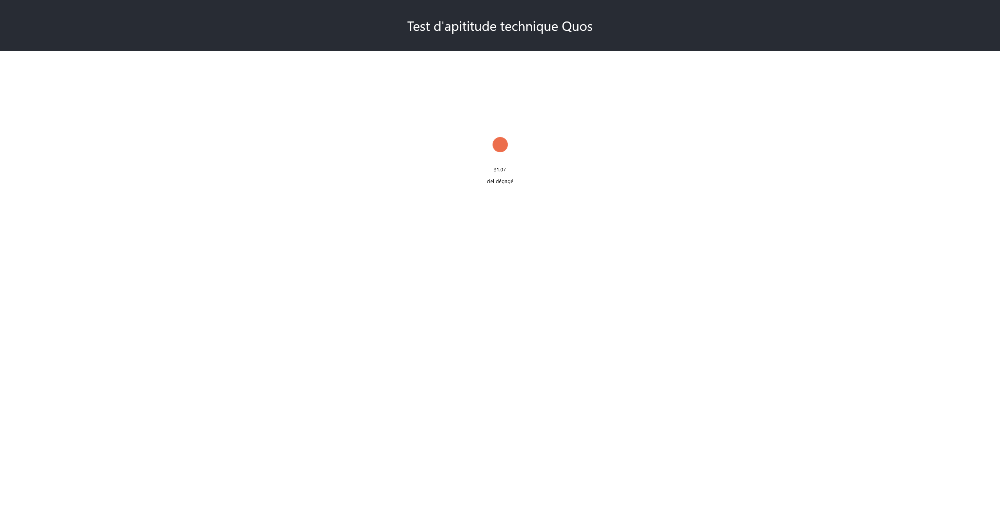

# basic_react_project_test

## Objectif 

L'objectif de cet exercice est d'afficher la météo grâce aux informations récupérée depuis une API.

Il faudra ainsi récupérer l'icone météo, la température et la description des conditions climatiques actuelles à l'aide des coordonnées GPS.
Idéalement, votre affichage devra être en français.

Vous n'avez besoin que de modifier le fichier `App.js`.

L'API pour récupérer la météo : https://openweathermap.org/current

Vous utiliserez Axios afin d'effectuer les appels d'API. De nombreuses ressources sont disponibles sur internet pour utiliser facilement Axios.

NB : La clé d'API est déjà fournie dans le fichier à modifier.

## Installation

Avant de commencer, il vous faut :
- GIT
- NodeJS

Il suffira de cloner le repo sur votre poste et d'initialiser un projet React via la commande `npm i` à lancer depuis le dossier `weather`.
Cela téléchargera les packages et dépendences nécessaires pour lancer le projet.
Ensuite, lancer le avec la commande `npm run start`.
Le projet devrait se lancer sur votre navigateur. 

## Condition de rendu

Travailler sur votre branche (pas sur le master).
Une fois terminé, publier votre branche sur git. 

